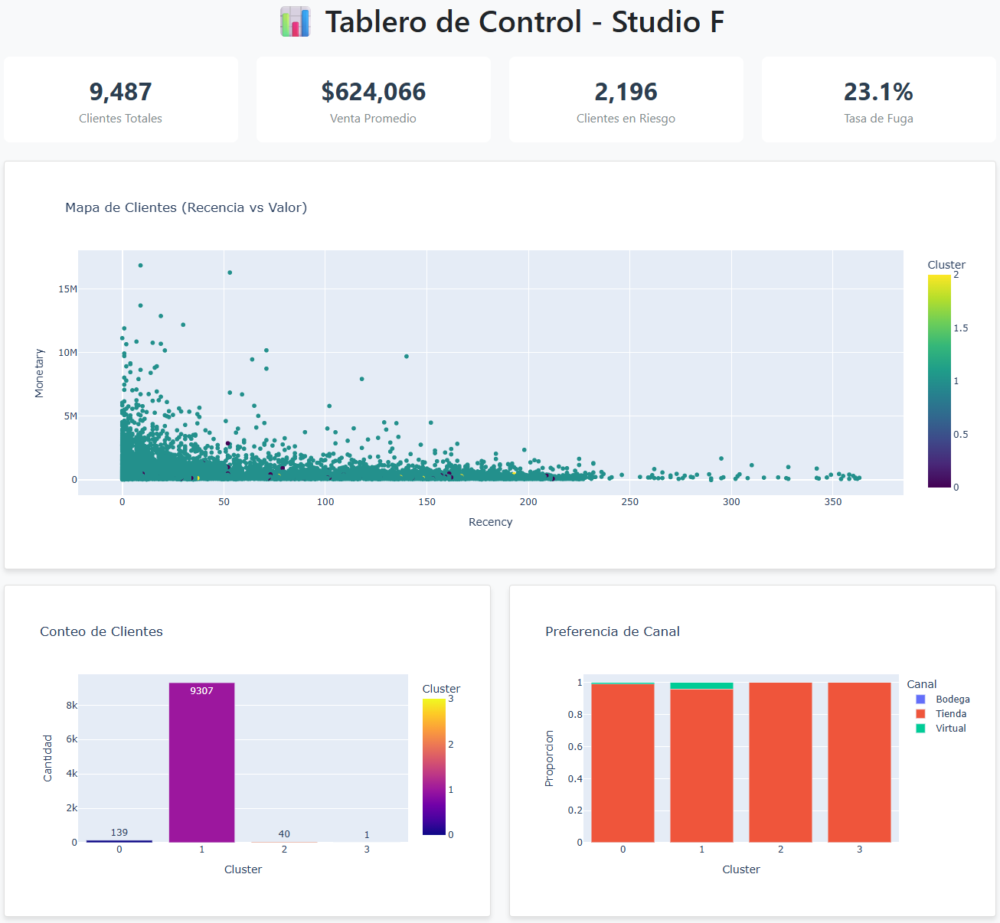

# Prueba Técnica - Analista de Datos BI

Este repositorio contiene la **Solución Completa** a la prueba técnica para el cargo de Analista de Datos BI.
A continuación se presenta la respuesta detallada a cada uno de los puntos solicitados en el documento `Prueba_tecnica_clientes.docx`.

## Tablero HTML (opcional)

## 📋 Estructura de la Solución

1.  [Entendimiento de la Información](#1-entendimiento-de-la-información)
2.  [Identificación de Variables](#2-identificación-de-variables-para-el-modelo-de-segmentación)
3.  [Segmentación de Clientes (K-Means)](#3-segmentación-con-metodología-estadística-k-means)
4.  [Señales de Fuga](#4-generación-de-señales-de-fuga-de-clientes)
5.  [Tablero de Control](#5-tablero-de-control-propuesta-power-bi)

---

# Prueba Técnica Analista de Datos BI - Análisis de Clientes

**Fecha:** 16 de Diciembre de 2025  
**Elaborado por:** [Su Nombre / Asistente AI]

---

## 1. Entendimiento de la Información

A continuación se describe el diccionario de datos de las variables identificadas en la base de datos `BD_Clientes` y `BD_Transaccional`.

### BD_Clientes (Maestra de Clientes)

| Variable | Tipo de Dato | Descripción | Transformación Sugerida |
|----------|--------------|-------------|-------------------------|
| `FkCliente` | Numérico (Entero) | Identificador único del cliente. | Ninguna (Llave primaria). |
| `Tipo` | Texto | Tipo de cliente (ej. Cliente Compartido). | Estandarización si hay variantes. |
| `CodTipoIdentificacion` | Numérico | Código del tipo de documento. | - |
| `TipoIdentificacion` | Texto | Descripción del tipo de documento (CC, CE). | - |
| `CodGenero` | Numérico | Código del género. | - |
| `Genero` | Texto | Género del cliente (F, M, N). | Normalización: CodGenero 0 corresponde a vacíos. Clasificar como 'No Informado'. |
| `Fecha_Nacimiento` | Fecha | Fecha de nacimiento. | Cálculo de `Edad`. Validar fechas futuras o nulas. |
| `Fecha_Ingreso` | Fecha | Fecha de registro del cliente. | Cálculo de `Antigüedad`. |
| `CodMarcaFavorita` | Numérico | Código de la marca favorita. | - |
| `CodMedioPagoFavorito` | Numérico | Código medio de pago favorito. | Medio de pago favorito con el que pago el cliente. |
| `MedioPagoFavorito` | Texto | Descripción medio pago favorito. | Medio de pago favorito con el que pago el cliente. |
| `CodFranquiciaFavorita` | Numérico | Código franquicia favorita. | Franquicia de la tarjeta debito/crédito. |
| `FranquiciaFavorita` | Texto | Descripción franquicia favorita. | Franquicia de la tarjeta debito/crédito. |
| `Fecha_Actualizacion` | Fecha | Última actualización de datos. | Recencia de contacto. |
| `CodMedioActualizacion` | Numérico | Código del medio de actualización. | - |
| `MedioActualizacion` | Texto | Descripción del medio de actualización. | - |
| `CodEstado` | Numérico | Código del estado. | - |
| `Estado` | Texto | Estado del cliente (Activo/Inactivo). | Filtro para campañas (Solo Activos). |
| `CIIU_Actividad_economica` | Numérico | Actividad económica (f200_id_ciiu). | Clasificación sectorial. |

**Campos esperados según el documento (validar existencia en la base):**

| Variable | Tipo de Dato | Descripción | Transformación Sugerida |
|----------|--------------|-------------|-------------------------|
| `CodDepartamento` | Numérico | Código del departamento del cliente. | Cruce geográfico. |
| `Departamento` | Texto | Nombre del departamento. | Limpieza de nombres. |
| `CodCiudad` | Numérico | Código de la ciudad del cliente. | Cruce geográfico. |
| `Ciudad` | Texto | Nombre de la ciudad. | Limpieza de nombres. |
| `Zona` | Texto | Zona geográfica comercial. | Análisis de cobertura. |
| `NkTienda` | Numérico | Tienda preferida/frecuente. | Identificación de tienda ancla. |

### BD_Transaccional (Histórico Transaccional)

| Variable | Tipo de Dato | Descripción | Transformación Sugerida |
|----------|--------------|-------------|-------------------------|
| `FkCliente` | Numérico | Llave foránea del cliente. | Cruce con BD_Clientes. |
| `FechaCalendario` | Fecha | Fecha de la transacción. | Extracción de Año, Mes, DíaSemana. Cálculo de `Recencia`. |
| `FkTiempo` | Numérico | Llave de tiempo (YYYYMMDD). | Redundante con FechaCalendario. |
| `FkProducto` | Numérico | Identificador del producto. | - |
| `FkMarca` | Numérico | Identificador de la marca. | - |
| `FkTipoEstablecimiento` | Numérico | Identificador del tipo de establecimiento. | - |
| `FkCategoria` | Numérico | Identificador de la categoría. | - |
| `NumDocumento` | Texto | Identificador de la factura/ticket. | Conteo para `Frecuencia`. |
| `Cantidad` | Numérico | Unidades compradas. | Suma total de items. |
| `VentaSinIVA` | Numérico | Monto de la venta (sin impuesto). | Suma para `Monto`. Manejo de devoluciones. |
| `CodDepartamento` | Numérico | Código del departamento. | - |
| `Departamento` | Texto | Nombre del departamento geográfico. | Análisis geográfico. |
| `CodCiudad` | Numérico | Código de la ciudad. | - |
| `Ciudad` | Texto | Nombre de la ciudad. | - |
| `Zona` | Texto | Zona geográfica comercial. | - |
| `NkTienda` | Numérico | Identificador de la tienda. | - |
| `Tipo` | Texto | Tipo de tienda/marca (ej. Ela). | - |
| `FechaAperturaTienda` | Fecha | Fecha de apertura de la tienda. | (Variable listada en requerimientos pero no hallada en dataset). |
| `TipoEstablecimiento` | Texto | Canal de venta (Tienda, Ecomm, Bodega). | Preferencia de Canal. |
| `NkFamilia` | Numérico | Identificador de familia de producto. | - |
| `NkLinea` | Numérico | Identificador de línea de producto. | - |
| `Familia` | Texto | Familia de producto (ej. Superiores). | - |
| `Linea` | Texto | Línea de producto (ej. Blusa, Jean). | Cálculo de Preferencias (% de gasto por línea). |
| `TipoProduccion` | Texto | Origen (Producido/No Producido). | - |
| `DescripcionMarca` | Texto | Descripción de la marca. | Preferencia de Marca. |

---

## 2. Identificación de Variables para el Modelo de Segmentación

Para segmentar los clientes con enfoque en comportamiento de compra y riesgo (fuga), se seleccionaron las siguientes variables derivadas (RFM + Preferencias):

1.  **Recencia (Recency):** Días transcurridos desde la última compra hasta la fecha de corte (31-Dic-2023). Clientes con alta recencia tienen mayor riesgo de fuga.
2.  **Frecuencia (Frequency):** Cantidad de transacciones únicas (`NumDocumento`) en el periodo. Mide la fidelidad.
3.  **Monto (Monetary):** Suma total de `VentaSinIVA`. Mide el valor del cliente (CLV histórico).
4.  **Preferencia de Canal:** Proporción de compras en `Tienda` vs otros canales (ej. Outlet/Bodega).
5.  **Preferencia de Línea (Top 10 + Otras):** Proporción de gasto en las líneas con mayor venta y un grupo residual.
6.  **Preferencia de Familia:** Participación del gasto por familia (Superiores, Inferiores, Monopieza, etc.).
7.  **Preferencia de Marca:** Participación del gasto por `DescripcionMarca`.

**Factores explícitos solicitados por la prueba (productos y canales):**
*   **Producto/Servicio:** participación del gasto por `Familia`, `Linea` (Top 10 + Otras) y `DescripcionMarca`.
*   **Canal de distribución:** `TipoEstablecimiento` y `Tipo` (tienda física, bodega/outlet, e-commerce).

**Variables adicionales de enriquecimiento (si existen en la fuente):**
*   **Geografía:** `Ciudad`, `Departamento`, `Zona` para clusters regionales.
*   **Tienda ancla:** `NkTienda` para segmentar por fidelidad a tienda.

**Nota sobre Lavado de Activos:**
Se incluyen variables de *Monto Total* y *Frecuencia* excesiva. En el análisis se detectó un cliente (Cluster 2) con un monto de inversión anómalo (≈445 Millones vs promedio de 500k), lo cual es una señal de alerta prioritaria para prevención de fraude/lavado de activos.

---

## 3. Segmentación con Metodología Estadística (K-Means)

### Justificación Metodológica
Para este análisis se seleccionó el **Aprendizaje No Supervisado (Clustering)**, específicamente el algoritmo **K-Means**, basado en el modelo **RFM (Recencia, Frecuencia, Valor Monetario)**.

**¿Por qué se escogió este método?**

1.  **Naturaleza de los Datos (Sin Etiquetas):** Los datos proporcionados son puramente transaccionales y **no cuentan con una etiqueta previa** (ej. "Cliente VIP", "Cliente Riesgoso"). Por lo tanto, los modelos predictivos supervisados (como árboles de decisión o regresión logística) no son aplicables en esta fase inicial, ya que requieren un histórico clasificado para entrenar.
2.  **Modelo RFM:** Es el estándar de la industria en retail para evaluar el valor del cliente. Permite agrupar objetivamente a los usuarios basándose en hechos (lo que hicieron) en lugar de suposiciones demográficas.
3.  **Objetividad del Algoritmo:** K-Means permite descubrir patrones ocultos y agrupar clientes por similitud matemática en su comportamiento de compra, eliminando el sesgo humano en la clasificación.

Se utilizó el algoritmo **K-Means Clustering** después de normalizar las variables (StandardScaler). El modelo incluye **RFM + participación por Línea (Top 10 + Otras) + Familia + Marca + Canal**. Se identificaron **4 Segmentos** principales:

### Perfil de los Segmentos

*   **Cluster 1: Compradores Base (57.5% de la población)**
    *   **Características:** Recencia promedio 64 días. Frecuencia 3.34. Gasto promedio $616k.
    *   **Canal:** Tienda física ~97%, virtual ~3%.
    *   **Preferencia:** Líneas Blusa (34%) y Jean (24%). Familias Superiores (51%) e Inferiores (37%).
    *   **Acción:** Programa de fidelización estándar y combos Blusa + Jean.

*   **Cluster 0: Complementos/Calzado/Tercera Pieza (34.8% de la población)**
    *   **Características:** Recencia 69 días. Frecuencia 3.18. Gasto promedio $558k.
    *   **Canal:** Tienda física ~95%, virtual ~5%.
    *   **Preferencia:** Línea Otras (68%), Tenis (7%), Chaqueta (7%). Familias Tercera Pieza (23%), Calzado (19%), Complementos (18%).
    *   **Acción:** Campañas de complementos y calzado con bundles.

*   **Cluster 3: Monopieza/Vestidos (7.6% de la población)**
    *   **Características:** Recencia 69 días. Frecuencia 2.11. Gasto promedio $372k.
    *   **Canal:** Tienda física ~96%, virtual ~4%.
    *   **Preferencia:** Línea Vestido (51%) y Enterizo (21%). Familia Monopieza (75%).
    *   **Acción:** Promociones de temporada (vestidos/enterizos) y cross-selling de accesorios.

*   **Cluster 2: Outlier / VIP / Alerta (1 Cliente)**
    *   **Características:** Gasto ≈$445 Millones. 2149 transacciones en un año. Recencia 0.
    *   **Acción:** **AUDITORÍA INMEDIATA**. Puede ser cliente corporativo, error de sistema o caso potencial de lavado de activos por volumen inusual.

---

## 4. Generación de Señales de Fuga de Clientes

Basado en el análisis de Recencia del Cluster principal (Habituales):
*   **Recencia Promedio:** ~66 días.
*   **Desviación Estándar (aprox):** ~60 días.

**Regla de Alerta de Fuga:**
Se define un cliente en riesgo de fuga si su inactividad supera los **120 días** (aprox. 4 meses, o Promedio + 1 Desviación Estándar).

**Estrategia:**
1.  **Señal Amarilla (60-90 días):** Email de "Te extrañamos" con novedades.
2.  **Señal Roja (>90-120 días):** Oferta agresiva de reactivación (Descuento temporal).
3.  **Fuga Confirmada (>180 días):** Pasar a base de recuperación (Win-back).

**Alineación con el tablero:** el KPI de riesgo usa el umbral **>120 días** y el semáforo lista alertas tempranas **>90 días**.

---

## 5. Tablero de Control (Propuesta Power BI)

El tablero se diseñaría con 3 páginas principales. Adicionalmente, se generó un **prototipo HTML** con Python para visualizar rápidamente los resultados.

### Página 1: Visión General (Overview)
*   **KPIs:** Ventas Totales, Ticket Promedio, Clientes Activos (Recencia < 120), Tasa de Fuga.
*   **Gráfico de Tendencia:** Ventas por mes 2023.
*   **Mapa/Gráfico:** Ventas por Ciudad.

### Página 2: Segmentación de Clientes
*   **Gráfico de Dispersión:** Recencia vs Monto (Coloreado por Cluster). Permite ver visualmente quienes se están alejando.
*   **Donut Chart:** Distribución de Clientes por Cluster.
*   **Tabla Detalle:** Lista de clientes filtrable por Cluster, mostrando "Días sin compra".

### Página 3: Alertas y Riesgo
*   **Semáforo de Fuga:** Lista de clientes que cruzaron el umbral de 90 días inactivos esta semana.
*   **Top Clientes Riesgo:** Clientes de alto valor (Cluster VIP) con Recencia en aumento.
*   **Alerta Lavado:** Visualización de transacciones > $X monto o frecuencia inusual (destacando el Outlier detectado).

**Datasets para tablero:**
*   `output/Clientes_Segmentados.csv`: base consolidada con RFM y cluster.
*   `output/Ventas_Mensuales.csv`: tendencia mensual.
*   `output/Ventas_Zona.csv`: ventas por ciudad/zona.
*   `output/Ventas_Linea.csv`: ventas por linea/familia.
*   `docs/index.html`: prototipo HTML generado por `src/generate_static_dashboard.py`.

---

## Archivos Entregables
1.  `output/Reporte_Tecnico.md`: Este documento.
2.  `src/03_segmentation.py`: Script de Python utilizado para el modelamiento.
3.  `output/Clientes_Segmentados.csv`: Base de datos marcada con el Cluster asignado.
4.  `docs/index.html`: Prototipo HTML del tablero (complementario a Power BI).
