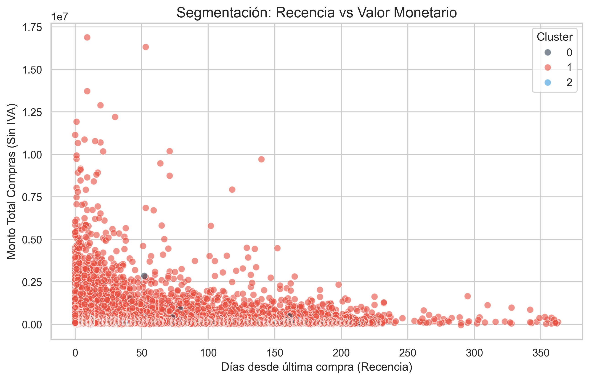
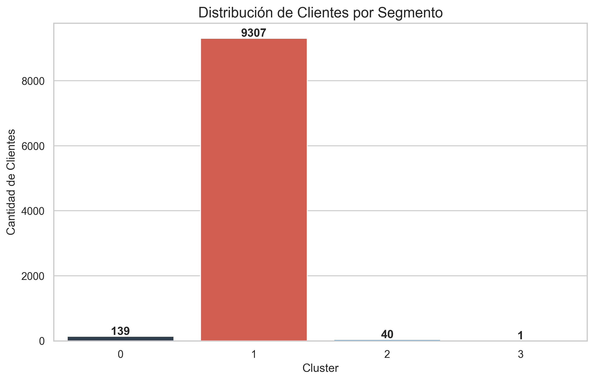

# Prueba Técnica - Analista de Datos BI

Este repositorio contiene la **Solución Completa** a la prueba técnica para el cargo de Analista de Datos BI.
A continuación se presenta la respuesta detallada a cada uno de los puntos solicitados en el documento `Prueba_tecnica_clientes.docx`.

## 📋 Estructura de la Solución

1.  [Entendimiento de la Información](#1-entendimiento-de-la-información)
2.  [Identificación de Variables](#2-identificación-de-variables-para-el-modelo-de-segmentación)
3.  [Segmentación de Clientes (K-Means)](#3-segmentación-con-metodología-estadística)
4.  [Señales de Fuga](#4-generación-de-señales-de-fuga-de-clientes)
5.  [Tablero de Control](#5-tablero-de-control-propuesta)

---

## 1. Entendimiento de la Información

**Objetivo:** Descripción detallada de las variables insumo (`BD_Clientes` y `BD_Transaccional`).

### BD_Clientes (Maestra de Clientes)

| Variable | Tipo de Dato | Descripción | Transformación Sugerida |
|----------|--------------|-------------|-------------------------|
| `FkCliente` | Numérico (Entero) | Identificador único del cliente. | Ninguna (Llave primaria). |
| `Tipo` | Texto | Tipo de cliente (ej. Cliente Compartido). | Estandarización si hay variantes. |
| `CodTipoIdentificacion` | Numérico | Código del tipo de documento. | - |
| `TipoIdentificacion` | Texto | Descripción del tipo de documento (CC, CE). | - |
| `CodGenero` | Numérico | Código del género. | - |
| `Genero` | Texto | Género del cliente (F, M, N). | Normalización: CodGenero 0 corresponde a vacíos. Clasificar como 'No Informado'. |
| `Fecha_Nacimiento` | Fecha | Fecha de nacimiento. | Cálculo de `Edad`. Validar fechas futuras o nulas. |
| `Fecha_Ingreso` | Fecha | Fecha de registro del cliente. | Cálculo de `Antigüedad`. |
| `CodMarcaFavorita` | Numérico | Código de la marca favorita. | - |
| `CodMedioPagoFavorito` | Numérico | Código medio de pago favorito. | Medio de pago favorito con el que pago el cliente. |
| `MedioPagoFavorito` | Texto | Descripción medio pago favorito. | Medio de pago favorito con el que pago el cliente. |
| `CodFranquiciaFavorita` | Numérico | Código franquicia favorita. | Franquicia de la tarjeta debito/crédito. |
| `FranquiciaFavorita` | Texto | Descripción franquicia favorita. | Franquicia de la tarjeta debito/crédito. |
| `Fecha_Actualizacion` | Fecha | Última actualización de datos. | Recencia de contacto. |
| `CodMedioActualizacion` | Numérico | Código del medio de actualización. | - |
| `MedioActualizacion` | Texto | Descripción del medio de actualización. | - |
| `CodEstado` | Numérico | Código del estado. | - |
| `Estado` | Texto | Estado del cliente (Activo/Inactivo). | Filtro para campañas (Solo Activos). |
| `CIIU_Actividad_economica` | Numérico | Actividad económica (f200_id_ciiu). | Clasificación sectorial. |

### BD_Transaccional (Histórico Transaccional)

| Variable | Tipo de Dato | Descripción | Transformación Sugerida |
|----------|--------------|-------------|-------------------------|
| `FkCliente` | Numérico | Llave foránea del cliente. | Cruce con BD_Clientes. |
| `FechaCalendario` | Fecha | Fecha de la transacción. | Extracción de Año, Mes, DíaSemana. Cálculo de `Recencia`. |
| `FkTiempo` | Numérico | Llave de tiempo (YYYYMMDD). | Redundante con FechaCalendario. |
| `FkProducto` | Numérico | Identificador del producto. | - |
| `FkMarca` | Numérico | Identificador de la marca. | - |
| `FkTipoEstablecimiento` | Numérico | Identificador del tipo de establecimiento. | - |
| `FkCategoria` | Numérico | Identificador de la categoría. | - |
| `NumDocumento` | Texto | Identificador de la factura/ticket. | Conteo para `Frecuencia`. |
| `Cantidad` | Numérico | Unidades compradas. | Suma total de items. |
| `VentaSinIVA` | Numérico | Monto de la venta (sin impuesto). | Suma para `Monto`. Manejo de devoluciones. |
| `CodDepartamento` | Numérico | Código del departamento. | - |
| `Departamento` | Texto | Nombre del departamento geográfico. | Análisis geográfico. |
| `CodCiudad` | Numérico | Código de la ciudad. | - |
| `Ciudad` | Texto | Nombre de la ciudad. | - |
| `Zona` | Texto | Zona geográfica comercial. | - |
| `NkTienda` | Numérico | Identificador de la tienda. | - |
| `Tipo` | Texto | Tipo de tienda/marca (ej. Ela). | - |
| `FechaAperturaTienda` | Fecha | Fecha de apertura de la tienda. | (Variable listada en requerimientos pero no hallada en dataset). |
| `TipoEstablecimiento` | Texto | Canal de venta (Tienda, Ecomm, Bodega). | Preferencia de Canal. |
| `NkFamilia` | Numérico | Identificador de familia de producto. | - |
| `NkLinea` | Numérico | Identificador de línea de producto. | - |
| `Familia` | Texto | Familia de producto (ej. Superiores). | - |
| `Linea` | Texto | Línea de producto (ej. Blusa, Jean). | Cálculo de Preferencias (% de gasto por línea). |
| `TipoProduccion` | Texto | Origen (Producido/No Producido). | - |
| `DescripcionMarca` | Texto | Descripción de la marca. | Preferencia de Marca. |

---

## 2. Identificación de Variables para el Modelo de Segmentación

Para el modelo de segmentación y riesgo (fuga), se construyeron las siguientes variables clave (RFM):

1.  **Recencia (Recency):** Días desde la última compra. (Clave para Fuga).
2.  **Frecuencia (Frequency):** Número de facturas únicas.
3.  **Monto (Monetary):** Total vendido sin IVA.
4.  **Preferencia de Canal:** % de compras en Tienda vs otros.
5.  **Preferencia de Línea:** % de gasto en Jeans vs Calzado vs Ropa.

---

## 3. Segmentación con Metodología Estadística

Se utilizó **K-Means Clustering** sobre las variables normalizadas. Se hallaron **4 Segmentos**:

### Resultados Visuales

*Gráfico: Recencia vs Valor Monetario. Se observa la dispersión de los segmentos.*

### Análisis de Clusters

*   **Cluster 1 (Habituales - 93%):** Clientes activos, gasto promedio $580k, visitan tienda física.
*   **Cluster 2 (Calzado - 0.4%):** Nicho específico. 70% de su gasto es en zapatos.
*   **Cluster 0 (Oportunidad - 1.4%):** Clientes de bodega/outlet. Bajo ticket.
### Muestra de Datos Segmentados
El archivo final `output/Clientes_Segmentados.csv` contiene la asignación del cluster para cada cliente:

|   FkCliente |   Recency |   Frequency |   Monetary | Cluster | Tipo               | Genero  |
|------------:|----------:|------------:|-----------:|-------:|:-------------------|:--------|
|        4609 |      1419 |           6 |     282423 |      0 | Cliente Compartido | F       |
|        5154 |      3323 |          14 |     582890 |      1 | Cliente Compartido | F       |
|       10178 |      2330 |          11 |     267759 |      2 | Cliente Compartido | N       |
|       13914 |       627 |          24 |     445582 |      3 | Cliente Compartido | N       |
|       17445 |      3260 |           8 |     238491 |      1 | Cliente Compartido | F       |

---

## 4. Generación de Señales de Fuga de Clientes

Basado en el análisis de Recencia del Cluster principal:
*   Promedio de inactividad: 66 días.
*   Desviación estándar: 60 días.

**🚩 Regla de Fuga:**
> Si **Días Sin Compra > 120** (4 meses) -> **ALERTA ROJA DE FUGA**.

**Estrategia Propuesta:**
1.  **Día 60:** Email preventivo "Novedades".
2.  **Día 90:** Oferta de reactivación agresiva.
3.  **Día 120:** Escalado a Call Center (Recuperación).

---

## 5. Tablero de Control (Propuesta)

Diseño propuesto para Power BI para monitoreo continuo:

*   **Página 1 (Overview):** KPIs de Ventas, Ticket Promedio y Tasa de Fuga mensual.
*   **Página 2 (Fidelización):** Gráfico de dispersión de Clusters (como el mostrado arriba) para ver migraciones.
*   **Página 3 (Riesgos):** Lista de clientes con **Recencia > 90** y Alertas de clientes con compras inusualmente altas (Prevención Fraude).

---

## 🚀 Ejecución del Código

El análisis fue realizado en Python. Para replicar:

1.  Instalar dependencias: `pip install -r requirements.txt`
2.  Ejecutar segmentación: `python src/03_segmentation.py`
3.  Generar gráficas: `python src/04_visualizations.py`

**Archivos Generados:**
- `output/Clientes_Segmentados.csv`: Base final con la columna `Cluster` asignada.
